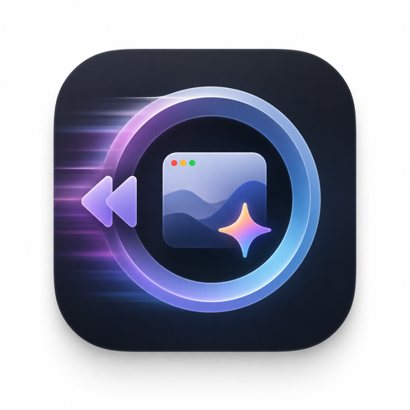

<div align="center">
  

  # Screen Recall

  **常驻 macOS 的"第二记忆" — 自动截屏、AI 理解、自然语言回溯。**

  
  
  
  [](https://github.com/ansonlianson/MacScreenRecall/actions/workflows/release.yml)

  [下载 DMG](https://github.com/ansonlianson/MacScreenRecall/releases/latest) ·
  [需求文档](screen-recall-requirements.md)
</div>

---

## 这是什么

类似 **Rewind**，但：
- 完全本地存储（数据/索引/缩略图都在 `~/Library/Application Support/ScreenRecall/`）
- **接你自己的模型 API**（OpenAI 兼容 / Anthropic 兼容 / 本地 LM Studio 都行）—— 不绑定任何云服务
- 双层管线：Tier-1 高频抓帧 + 多模态理解；Tier-2 低频做问答 / 日报 / TODO 抽取

每 30 秒抓一次屏幕（间隔可调） → VLM 提取 summary / app / 画面里的数字 / 网址 / TODO 候选 → 落 SQLite + FTS + Embedding 索引。任何时候可以问"我刚才在干嘛？"或"那个视频的播放量是多少？"，能跳到对应时间点的画面回看。

## ✨ 主要功能

| | |
|---|---|
| 📸 **持续采集** | ScreenCaptureKit 抓所有显示器，pHash 去重（变化才存盘）；锁屏自动停 |
| 🧠 **Tier-1 实时理解** | 每帧调多模态模型 → JSON 提取 summary / app / 数字 / 网址 / TODO 候选 |
| ⏪ **Rewind 风格回溯** | 大图 + 底部时间轴 strip，← → 键导航；关键字 / 自然语言搜索高亮命中 |
| 🔍 **混合检索** | SQLite FTS5 trigram（中文友好）+ Embedding 余弦排序 + RRF 融合 |
| 📝 **每日日报** | 23:00 自动；30 分钟桶时间线 + activity 占比 + TOP 应用 + TODO 摘要 |
| ✅ **TODO 自动抽取** | 从画面 / 聊天 / 邮件中识别 → Tier-2 二审过滤误召回 |
| 🛠 **自定义计划任务** | 用户写 prompt + cron（`daily HH:MM` / `weekly D HH:MM` / `hourly:N`） → 输出报告/TODO/通知 |
| 🔌 **任意模型接入** | 直接填 endpoint + model + API Key；默认两条 DashScope profile，可以改 OpenAI/Anthropic/LM Studio |
| 🖥 **macOS 26 原生** | SwiftUI + Liquid Glass 材质 + MenuBar Extra + SMAppService 自启动 |

## 📦 安装

1. 从 [Releases](https://github.com/ansonlianson/MacScreenRecall/releases/latest) 下载 `ScreenRecall-x.x.x-arm64.dmg`
2. 打开 DMG，把 ScreenRecall.app 拖到 Applications
3. **第一次打开会被 Gatekeeper 拦**（ad-hoc 签名，未走 Apple 公证）。两种绕法二选一：
   - 在「访达」里 Control-点击 ScreenRecall.app → 「打开」 → 弹窗里再点「打开」
   - 终端执行 `xattr -dr com.apple.quarantine /Applications/ScreenRecall.app`
4. 首次启动按提示授予**屏幕录制**权限（系统设置 → 隐私与安全性 → 屏幕录制）

## 🔑 首次配置

打开主窗口（点菜单栏眼睛图标） → 「设置」Tab → 「模型管理」：

- 默认有两条 profile 指向阿里云 DashScope（`coding.dashscope.aliyuncs.com`），编辑（笔形图标）填入你的 API Key
- 想用 OpenAI / Claude / 本地 LM Studio？把 endpoint 改成对应 baseURL：
  - OpenAI 兼容：`https://api.openai.com/v1` / `http://192.168.x.x:1234/v1`（LM Studio）
  - Anthropic 兼容：`https://api.anthropic.com/v1`
- 「用途绑定」里把 Tier-1（实时分析）和 Tier-2（提问/报告）各指到一条 profile
- Embedding 留空 → 用 Apple 系统的 `NLContextualEmbedding`（零依赖）；想要更高质量在 LM Studio 加载 bge-m3 GGUF + 加一条 `kind=embedding` 的 profile

## 🗂 数据在哪

```
~/Library/Application Support/ScreenRecall/
├── recall.db              # SQLite（FTS5 trigram + analysis_embeddings）
├── frames/YYYY/MM/DD/*.jpg
├── reports/YYYY-MM-DD.md
└── logs/*.log
```

API Key 存 macOS Keychain（service `com.anson.ScreenRecall`，account `model.<UUID>`），不进 plist 也不进 DB。

## 🏗 架构

```
                     ┌───────────────────────┐
                     │  SwiftUI 主窗口 + 菜单栏 │
                     └──────────┬────────────┘
                                │
   ScreenCaptureKit ─► Capturer ─► pHash dedup ─► 写盘 + 入 frames(pending)
                                                          │
                              Worker pool (concurrency 1-4)
                                                          ▼
                              Tier-1 Provider (OpenAI 兼容 / Anthropic 兼容)
                                                          ▼
                              JSON 解析 → analyses + analyses_fts + embedding
                                                          ▼
                       Retriever (FTS trigram + Embedding cosine + RRF)
                                                          ▼
                  Tier-2 Pipeline: 问答 / 日报 / TODO 抽取 / 自定义计划任务
```

每个组件单文件、可读、可换。Provider 抽象成 `LLMProvider` protocol，OpenAI/Anthropic 两套实现共一个 `ModelProfile` 数据模型。

## 🛠 从源码构建

```bash
brew install xcodegen
git clone https://github.com/ansonlianson/MacScreenRecall.git
cd MacScreenRecall/ScreenRecall
xcodegen generate
open ScreenRecall.xcodeproj
# 或者命令行
xcodebuild -scheme ScreenRecall -configuration Debug \
  -destination 'platform=macOS' -derivedDataPath ./build build
open ./build/Build/Products/Debug/ScreenRecall.app
```

依赖：Xcode 26+ / macOS 26 SDK。SwiftPM 自动拉 GRDB / KeychainAccess / swift-markdown-ui。

打 Release + DMG 见 `dist/` 流程（仓库未跟踪）。

## 🗺 Roadmap

- [x] M1-M9 基础闭环（采集 / Tier-1 / Tier-2 / 报告 / TODO / 计划任务 / 自检）
- [x] 中文检索（FTS5 trigram + CJKTokenizer + LIKE 兜底）
- [x] Rewind 风格回溯 Tab
- [x] ModelProfile 列表化
- [x] Embedding hybrid 检索（Apple NL + OpenAI 兼容双路径）
- [ ] 周报实做（schema 已留）
- [ ] sqlite-vec 取代内存余弦排序（数据量大后）
- [ ] Developer ID 签名 + Apple 公证（朋友双击即开）
- [ ] 本地 mlx-swift 跑 bge-m3，纯离线

## 隐私

- 100% 本地存储；唯一外网请求是你**主动配置**的模型 API
- 锁屏期间完全停采集
- 排除应用 / 窗口标题正则黑名单（设置中可加）
- 数据库与 frames 目录权限 0700
- API Key 仅存 Keychain

## 📜 License

MIT
